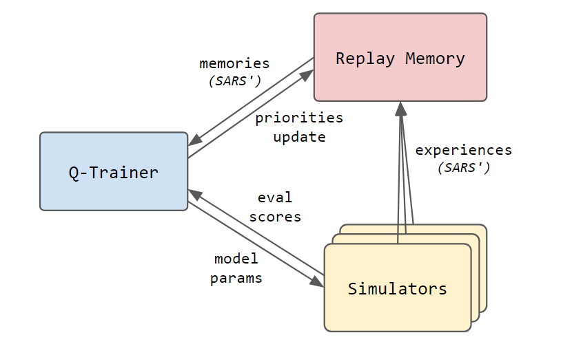
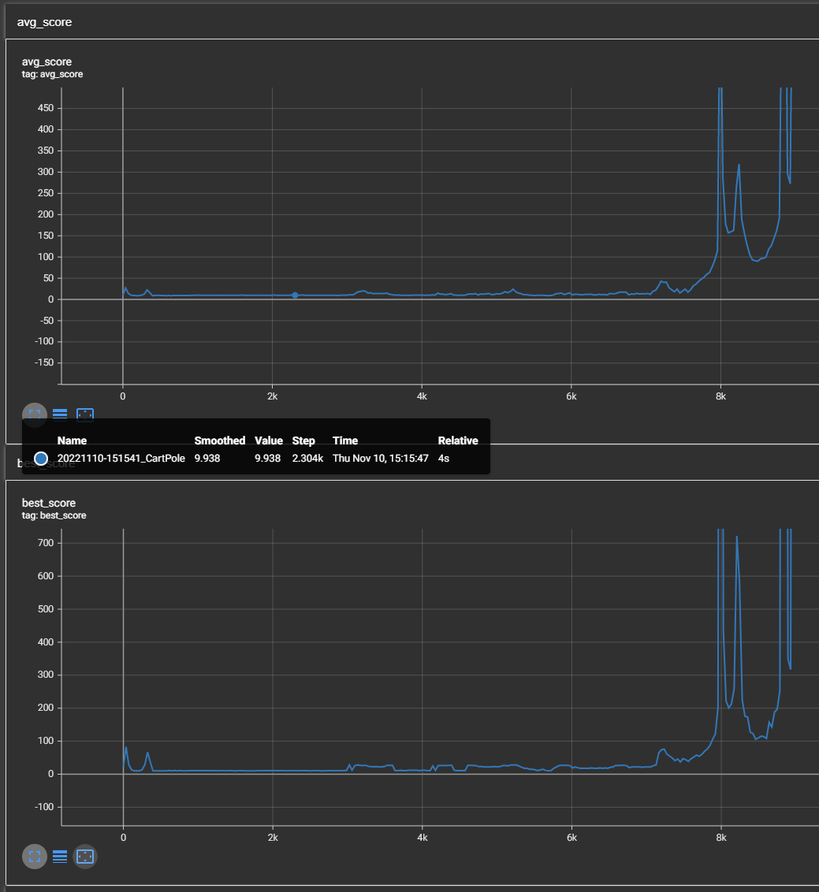

# **d3q** :: Q-Learning Showcase

This project contains a demonstration framework of Q-learning (reinforcement learning) written in Python.
It takes advantage of _TensorFlow_ to address one of the simplest _OpenAI Gym_ problems: the _Cart Pole_.

> ⚠ **Warning**
> Foundations of this project were created for a hackaton to demonstrate a ML system utilizing all 8 hardware accelerators and all CPU cores on a modern, ML-dedicated server.
> If you are looking for a Reinforced Learning framework - this is not the right project:
> you are probably looking for [TensorFlow Agents](https://www.tensorflow.org/agents) or [Ray RLlib](https://docs.ray.io/en/latest/rllib).

To start, just clone the sources and run:

```bash
# one-time setup
python --version  # should be 3.7-3.10
pip install virtualenv
python -m virtualenv venv
source .\venv\bin\activate  # on Windows: .\venv\Scripts\activate
pip install -r .\requirements.txt
pip install -r .\requirements-test.txt
python -m pytest -vs .

# run the training
python -m d3q.apps.train

# run concurrently to see how the training advances
python -m d3q.apps.preview
```

## Design

At the core of the solution lay the separation of the Q-learning process into three asynchronous entities:
- _Q-Trainer_ - the main training process perfoming actual gradient-descent steps using _TensorFlow_.
- _Simulators_ - multiple independent environments exploring the state space, gathering SARS' experiences, and evaluating new versions of the model.
- _Replay Memory_ - a prioritized replay buffer of SARS' samples, which memorizes new entries, samples them randomly, then updates samples' priorities.



All of them are operated by distinct Python processes and use inter-proces queues to communicate.

The main process spawns the replay memory and simulators, all as services.
Simulators start playing games once they receive the initial model parameters, where the first playthrough is purely for evaluation purposes (actions are not affected by the random policy).
Sims gather SARS' samples and send them as experience batches to the replay memory, which stores them in the prioritized replay memory.
Once the replay memory has sufficient number of records in its store, it starts sampling them randomly, forming the batch of memories provided to the Q-trainer.
The Q-trainer receives the SARS' memories and perform a Q-learning training step.
After specific number of steps, the model is saved and its parameters send to simulators.
The training stops either after the evaluation score reaches the pre-set goal, or the training fails, reaching arbitrary time or sample-based limit.

During the training you can see the learning curve using TensorBoard:

```bash
python -m tensorboard.main --logdir tblog
```



The axis X is expressed in terms of number of samples (SARS' memories) processed by the Q-trainer.
The model itself and the hyperparameters are optimized to minimize this particular value, i.e. number of samples processed to reach the high average evaluation score.

In `ReplayMemory`, SARS' records are indexed using sophisticated _priority tree_ data structure, which allows for storing larger amount of data and manipulating its corresponding sampling priorities.
